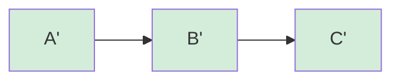
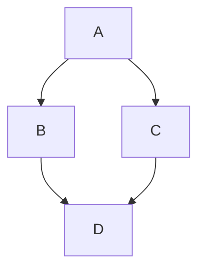

# Skills for Developing bb

## Learning bb Features

Use `bb skills` to generate comprehensive AI-readable reference documentation:

```bash
bb skills
```

This command outputs all CLI commands, their arguments, and usage patterns in a structured format optimized for AI assistants (like Claude). The output includes:
- Complete command reference with all subcommands
- Argument specifications and constraints
- Help text and descriptions
- Current implementation status

**Use case**: When Claude (or another AI assistant) needs to understand what bb can do, run `bb skills` and share the output to provide complete context about available features.

## Makefile Targets

- `make help` — list all targets
- `make check` — run all tests
- `make check-with-coverage` — run tests with coverage report (generates `htmlcov/`)
- `make miss` — list functions below 80% coverage, least covered first
- `make clean` — remove generated files (htmlcov, .coverage, __pycache__)

## Running Tests

Run all tests:

```bash
uv run pytest
```

Run a single transcript:

```bash
uv run pytest --transcript 01
```

Run transcript tests only:

```bash
uv run pytest tests/transcript/test_transcripts.py
```

Run tests matching a keyword:

```bash
uv run pytest -k "add"
```

## Adding a New CLI Command

All code lives in `bb.py` — no splitting into packages.

1. Write `command_mycommand()` function (or `code_mycommand()` if it's a core operation)
2. Add a subparser in `main()` near line 4458:
   ```python
   mycommand_parser = subparsers.add_parser('mycommand', help='...')
   mycommand_parser.add_argument('arg', help='...')
   ```
3. Add dispatch in the `if/elif` chain near line 4574:
   ```python
   elif args.command == 'mycommand':
       command_mycommand(args.arg)
   ```

## Computing Hashes for a Transcript

Before writing a transcript, compute actual hashes by adding functions to a temporary pool. Build leaf functions first (no bb imports), then dependent functions:

```bash
export BB_DIRECTORY=$(mktemp -d)
mkdir -p "$BB_DIRECTORY/pool"
uv run python bb.py add parse_frontmatter_eng.py@eng  # leaf — note the hash
uv run python bb.py add render_post_eng.py@eng         # depends on leaves — note the hash
```

Functions must have real hashes in their `from bb.pool import object_<hash>` lines before you can `bb add` them.

## Using `bb refactor`

`bb refactor` replaces a dependency hash with another in a function's import graph, propagating the change through all intermediate functions in the chain. It creates new pool entries — the originals are never modified.

### Two variants

**Global refactor** — replaces FROM with TO everywhere in WHAT's dependency graph:

```bash
bb refactor WHAT FROM TO
```

**Surgical refactor** — replaces FROM with TO only in the path from AT upward to WHAT:

```bash
bb refactor WHAT FROM TO AT
```

### What it does

It rewrites the entire program without you manually editing intermediate functions. You write the new leaf implementation; refactor handles the rest.

Given a call graph A → B → C (A imports B, B imports C):


`bb refactor A C C'` rewrites B's import of C to C', producing B'. Then rewrites A's import of B to B', producing A':



- Both B' and A' are new pool entries with all language mappings copied and alias_mappings updated.
- A, B, and C remain untouched in the pool (append-only).

### When to use it

- **Drop-in replacement**: You improved `markdown_to_html` (same interface, better implementation). Use `bb refactor build_blog OLD_MARKDOWN NEW_MARKDOWN` to propagate through `render_post` and up to `build_blog`.
- **Surgical update**: A → B → C and A → D → C. You only want to swap C in the B path, not the D path. Use `bb refactor A C C' B` to limit the change to the B→C edge.

### When NOT to use it

- **Interface changes**: If the new function has a different signature (added/removed parameters), callers need their body logic updated too. `bb refactor` only rewrites import hashes and `_bb_v_0` call targets — it does not modify function bodies.

### Call graph examples

**Linear chain** `A → B → C`, swap C for C':

```bash
bb refactor $A $C $C_PRIME
# Creates B' (imports C' instead of C)
# Creates A' (imports B' instead of B)
# Output: new hash: A'
```

**Diamond** — swap D for D':



```bash
# Global: rewrites both B and C
bb refactor $A $D $D_PRIME
# Creates B' (imports D'), C' (imports D'), A' (imports B' and C')

# Surgical: only rewrite the B→D edge
bb refactor $A $D $D_PRIME $B
# Creates B' (imports D'), A' (imports B' but still imports original C)
```

**Direct dependency** `A → B`, swap B for B':

```bash
bb refactor $A $B $B_PRIME
# Just rewrites A's import. No intermediates.
# Output: new hash: A'
```

### Output format

```
new hash: <64-char hex>
```

### Capture in transcripts

```bash
$ REFACTORED_HASH=$(bb refactor $WHAT $FROM $TO | awk '{print $3}')
```

## Debugging a Failing Transcript Step

The test output shows:
- Which step failed and the command that ran
- Expected output vs actual output

Common pitfalls:
- `bb show HASH@eng` prints import lines before the function def for functions with bb imports — use `| grep '^def '` instead of `| head -1`
- String literals (`'Untitled'`, `'Home'`) are part of the logic, not identifiers — they must be identical across language versions or hashes will differ
- `bb translate` is interactive (uses `input()`) — use `bb add file@lang` instead in transcripts

## Test Conventions

- All tests are **functions**, never classes
- Use `normalize_code_for_test()` from `tests/conftest.py` for any normalized code string in tests
- Grey-box integration style: call CLI commands, assert on internal storage structure
- Unit tests only for complex algorithms (AST normalization, hashing) in `tests/test_internals.py`

## Naming Convention

Pattern: `type_name_verb_complement`

Preferred type prefixes: `code_`, `command_`, `compile_`, `git_`, `helper_`, `storage_`, `hash_`

Examples:
- `code_add()` — add code to the pool
- `command_compile()` — CLI handler for compile
- `hash_compute()` — compute a hash
- `helper_open_editor_for_message()` — utility that doesn't fit other categories

## Single-File Architecture

All code lives in `bb.py`. No modularization into packages. This keeps the tool simple, self-contained, and easy to distribute as a single script.

## Git Workflow

- Branch naming: `claude/*` for AI-generated branches
- Commit messages: imperative mood ("Add", "Extract", "Fix"), be specific ("Add 'bb show HASH@lang' command")

## Creating a New Transcript

A transcript is a markdown file in `transcripts/` that serves as both documentation and an executable test. The test runner parses it, writes the source files to a temp directory, then executes the workflow steps in order.

### File naming

Use the pattern `NN-short-name.md` where `NN` is a zero-padded sequence number.

### Structure

```markdown
# Transcript: Title

## Metadata
- ID: NN
- Feature: short description
- Date: YYYY-MM-DD
- Status: draft
- Complexity: beginner|intermediate|nerd

## Overview
One paragraph explaining what the transcript demonstrates.

## Prerequisites
- `bb` installed and in PATH
- `BB_DIRECTORY` configured (or using default `~/.local/bb/`)

---

# Chapter N: Title

## Source Files

### Description `filename.py`
\```python
def my_function(arg):
    """Docstring."""
    return arg
\```

## Workflow

### Step 1: Description
\```bash
$ bb add filename.py@eng
HASH
\```
```

### Key rules

- **Source files**: A heading like `### Description \`filename.py\`` followed by a fenced code block. The runner writes these to the working directory before executing any steps.
- **Workflow steps**: Lines starting with `$ ` inside bash blocks are commands. Lines without `$ ` are expected output. The runner verifies actual output matches.
- **Variable capture**: When expected output is a single bare word (like a hash), it becomes a variable named after the step context (e.g., `PARSE_HASH`). Use `$VARIABLE` in later commands.
- **Skip a step**: Add `# SKIP-TEST: reason` as the first line of a bash block to exclude it from test execution. Use for heredocs, diff demonstrations, or anything the runner can't handle.
- **Expected failure**: Set `Status: xfail` in metadata. The transcript runs but failures don't break CI.
- **Hashes are known at write time**: Compute hashes by running `bb add` before writing the transcript. Embed them directly in source files — no placeholders or sed substitution.
- **bb compile in tests**: Use `bb compile --output file.py HASH@eng` instead of shell redirection (`>`), since the test runner doesn't interpret shell redirection.
- **Multilingual functions**: Only identifiers and docstrings differ between language versions. String literals are part of the logic and must be identical across translations to produce the same hash.

### Narrative Style - Tell Stories, Not Test Scripts

Transcripts serve dual purposes: **integration tests** AND **living documentation**. Write transcripts that tell realistic user stories, not just command catalogs.

**Golden example**: See `transcripts/04-check-and-run.md` for best practices.

#### Key Principles

1. **Use chapters for narrative arcs** - Group steps into thematic sections with clear purposes
   - Good: `# Chapter 1: Building the Core Function`, `# Chapter 2: Collaborative Translation`
   - Bad: `# Part 1`, `# Testing`, generic numbered sections

2. **Provide context before commands** - Explain *why* before *what*
   ```markdown
   # Chapter 2: Adding Tests

   Now that we have the tokenizer, let's add property-based tests using
   @check decorators. These tests verify edge cases like empty strings
   and Unicode handling.

   ### Step 3: Add empty string test
   ```

3. **Build complexity progressively** - Start simple, then layer on features
   - Chapter 1: Single function, basic workflow
   - Chapter 2: Composition (functions importing other functions)
   - Chapter 3: Multiple languages (same logic, different identifiers)
   - Chapter 4: Error handling and recovery

4. **Show realistic mistakes** - Real developers make errors
   ```markdown
   ### Step 8: Try to push (fails - forgot to commit)
   $ bb remote push origin
   No commits to push

   Oops! We need to commit first. Let's fix that.

   ### Step 9: Commit the function
   $ bb commit $HASH -c "Add tokenizer"
   ```

5. **Use rich domain examples** - Not `foo`/`bar`, but dice games, blog engines, text processors
   - Examples should demonstrate bb features naturally
   - Include interesting algorithms (Leibniz series, word games, etc.)

6. **End with summary + insights**
   ```markdown
   ## Summary
   | Command | Purpose |
   |---------|---------|
   | bb check | Run @check tests |

   ## Key Insights
   1. **@check is metadata**: Decorator parsed during `bb add`, not runtime
   2. **Hash stability**: Same logic = same hash across languages
   ```

#### Coverage Strategy

Transcripts are integration tests. Improve coverage by:

- **Testing error paths**: Try to push to read-only remote (show error message)
- **Exercising variants**: Show commands by name AND by hash
- **Natural edge cases**: Empty pools, missing dependencies, conflicts

#### Review Checklist

Before submitting:
- [ ] Has narrative chapters (not just "Step 1, Step 2...")
- [ ] 2-3 paragraphs of context per chapter
- [ ] Uses realistic examples (not foo/bar)
- [ ] Shows success AND error cases
- [ ] All commands in "Feature:" metadata are executed
- [ ] Ends with Summary and Key Insights
- [ ] Tested with `pytest --transcript NN`
- [ ] Improved coverage (verify with `make miss`)
