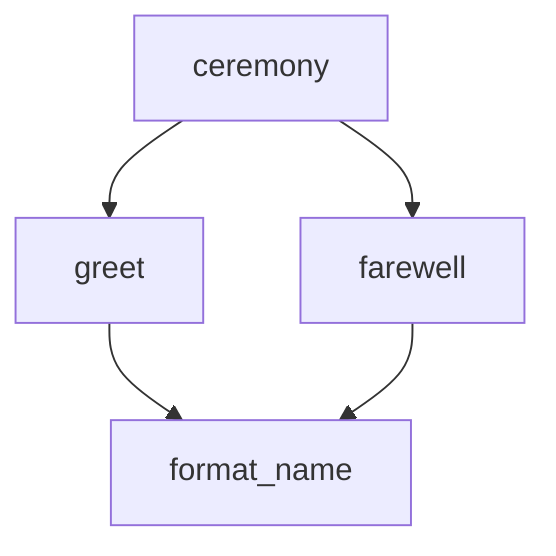
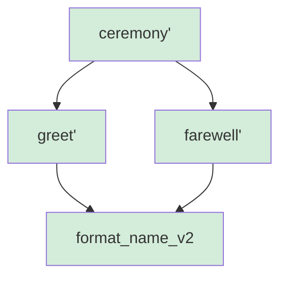
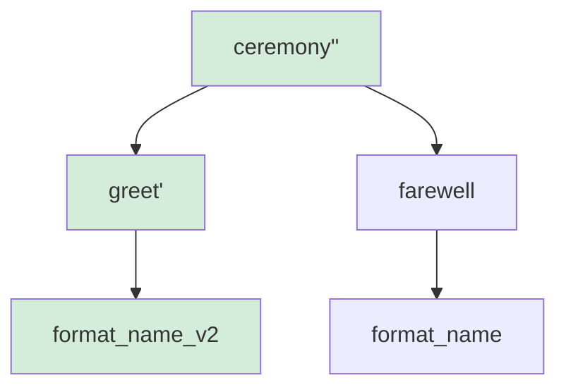
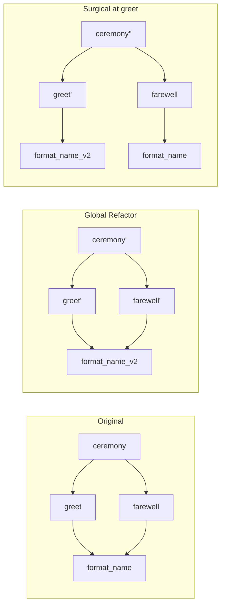

# Transcript: Using bb refactor

## Metadata
- ID: 03
- Feature: bb refactor global and surgical variants
- Date: 2026-02-11
- Status: draft
- Complexity: intermediate

## Overview
`bb refactor` replaces a dependency in a function's import graph and propagates the change through all intermediate functions. This transcript builds a diamond-shaped call graph, then demonstrates both the global variant (update everywhere) and the surgical variant (update only one path). The originals are never modified — the pool is append-only.

## Prerequisites
- `bb` installed and in PATH
- `BB_DIRECTORY` configured (or using default `~/.local/bb/`)

---

# Chapter 1: Building a Diamond Call Graph

Four functions form a diamond dependency: `ceremony` imports both `greet`
and `farewell`, which each import `format_name`.



## Source Files

### Name Formatter `format_name_eng.py`
```python
def format_name(first, last):
    """Format a full name from first and last parts."""
    return first + ' ' + last
```

### Greeting `greet_eng.py`
```python
from bb.pool import object_4e66d6c3a6a9c634af0611c545711a35a02e924498f413d78251d95dd63d8fd1 as format_name


def greet(first, last):
    """Generate a greeting."""
    name = format_name(first, last)
    return 'Hello, ' + name + '!'
```

### Farewell `farewell_eng.py`
```python
from bb.pool import object_4e66d6c3a6a9c634af0611c545711a35a02e924498f413d78251d95dd63d8fd1 as format_name


def farewell(first, last):
    """Generate a farewell."""
    name = format_name(first, last)
    return 'Goodbye, ' + name + '.'
```

### Ceremony `ceremony_eng.py`
```python
from bb.pool import object_60081acc7222a2d6343cd23a619c80f773c6fee312ee41d67943e5f351d851dd as greet
from bb.pool import object_e44c6ba9183d24d9df3529843f951c402ffb734378898d42fbef6ab504584117 as farewell


def ceremony(first, last):
    """Run a full greeting and farewell ceremony."""
    return greet(first, last) + '\n' + farewell(first, last)
```

### Improved Name Formatter `format_name_v2_eng.py`
```python
def format_name(first, last):
    """Format a full name with proper capitalization."""
    return first.capitalize() + ' ' + last.capitalize()
```

## Workflow

### Step 1: Add the leaf function
```bash
$ FORMAT=$(bb add format_name_eng.py@eng | grep '^Hash:' | awk '{print $2}')
```

### Step 2: Add greet and farewell (both depend on format_name)
```bash
$ GREET=$(bb add greet_eng.py@eng | grep '^Hash:' | awk '{print $2}')
```

```bash
$ FAREWELL=$(bb add farewell_eng.py@eng | grep '^Hash:' | awk '{print $2}')
```

### Step 3: Add ceremony (depends on greet and farewell)
```bash
$ CEREMONY=$(bb add ceremony_eng.py@eng | grep '^Hash:' | awk '{print $2}')
```

### Step 4: Add the improved format_name
```bash
$ FORMAT_V2=$(bb add format_name_v2_eng.py@eng | grep '^Hash:' | awk '{print $2}')
```

### Step 5: Verify the two format_name versions have different hashes
```bash
$ test "$FORMAT" != "$FORMAT_V2" && echo "different hashes"
different hashes
```

### Step 6: Verify the diamond call graph
```bash
$ bb show $CEREMONY@eng | grep '^from '
from bb.pool import object_60081acc7222a2d6343cd23a619c80f773c6fee312ee41d67943e5f351d851dd as greet
from bb.pool import object_e44c6ba9183d24d9df3529843f951c402ffb734378898d42fbef6ab504584117 as farewell
```

---

# Chapter 2: Global Refactor

`bb refactor WHAT FROM TO` replaces FROM with TO everywhere in WHAT's
dependency graph. Every function that transitively depends on FROM gets a
new version with the updated reference.

For our diamond, swapping `format_name` for `format_name_v2` creates
three new pool entries. The originals remain untouched.



## Workflow

### Step 7: Run global refactor
```bash
$ CEREMONY_GLOBAL=$(bb refactor $CEREMONY $FORMAT $FORMAT_V2 | grep '^new hash:' | awk '{print $3}')
```

### Step 8: The refactored ceremony is different from the original
```bash
$ test "$CEREMONY" != "$CEREMONY_GLOBAL" && echo "new ceremony hash"
new ceremony hash
```

### Step 9: Inspect the refactored ceremony — both imports changed
```bash
$ bb show $CEREMONY_GLOBAL@eng | grep '^def '
def ceremony(first, last):
```

### Step 10: Compile and run the global-refactored ceremony
```bash
$ bb compile --output ceremony_global.py $CEREMONY_GLOBAL@eng
```

### Step 11: The original ceremony is still in the pool
```bash
$ bb show $CEREMONY@eng | grep '^def '
def ceremony(first, last):
```

---

# Chapter 3: Surgical Refactor

`bb refactor WHAT FROM TO AT` limits the replacement to the path from AT
upward to WHAT. Only functions in that path get new versions.

For our diamond, swapping `format_name` for `format_name_v2` **only at
`greet`** leaves `farewell` untouched. Two new pool entries instead of three.



## Workflow

### Step 12: Run surgical refactor (only the greet path)
```bash
$ CEREMONY_SURGICAL=$(bb refactor $CEREMONY $FORMAT $FORMAT_V2 $GREET | grep '^new hash:' | awk '{print $3}')
```

### Step 13: Surgical result differs from global result
```bash
$ test "$CEREMONY_GLOBAL" != "$CEREMONY_SURGICAL" && echo "global != surgical"
global != surgical
```

### Step 14: Compile the surgical-refactored ceremony
```bash
$ bb compile --output ceremony_surgical.py $CEREMONY_SURGICAL@eng
```

---

## Summary



| Variant | New pool entries | What changed |
|---------|-----------------|--------------|
| Global  | greet', farewell', ceremony' | All paths to format_name updated |
| Surgical | greet', ceremony'' | Only the greet path updated |

## Key Insights

1. **No manual editing of intermediates**: `bb refactor` rewrites the entire program — every intermediate function between the swapped dependency and the target — without you touching any of them. You only write the new leaf implementation; refactor handles the rest.

2. **Append-only pool**: The originals are never modified. Every refactored function is a new pool entry. You can always go back.

3. **Chain propagation**: Swapping a leaf dependency cascades through every intermediate function up to the target. The deeper the dependency, the more functions get new hashes.

4. **Surgical precision**: When a function appears in multiple dependency paths (diamond), the surgical variant lets you update one path without touching others. Useful when you want different implementations in different contexts.

5. **Language mappings preserved**: `bb refactor` copies all language mappings (eng, fra, etc.) from old functions to new ones, updating alias_mappings to point to the new dependency hashes.
